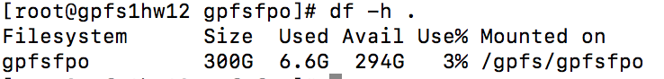

## Set up of the GPFS file system across 3 nodes

* The set up was successfully completed as indicated by the following check 

## LazyNLP 

**How much disk space is used after step 4?**
* The disk space used by AUS-gutemberg was 938M. Will update with the space requirements for reddit once the process completes.

**Did you parallelize the crawlers in step 4? If so, how?**
* The files are marked with the year and month so I split the files into different directories based on the year 2007 to 2018 and then ran one crawler instance per year. Each crawker will handle only one year of data. I could even split it to one per month and have more parallel processing done.

**Describe the steps to de-duplicate the web pages you crawled.**
* One way to de-dupe is to make sure that the files have less than threshold n-gram overlapping with the current dataset

**Submit the list of files you that your LazyNLP spiders crawled (ls -la).**
* Here is the list of the files from the AUS-gutemberg. I will update the list with the reddit files once the process completes.

